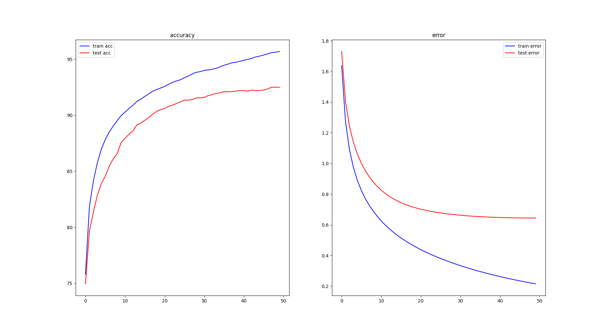

trainning

args = {
    'times': 50,
    'eta': 1e-1,
    'pen': 1e-4,
    'converge_gap': None,
    'batch_size': 10,
    'acc_quit': 99.9
}

error of train: (95.69, 0.2151036280834987)
error of test: (92.5, 0.6444837484941124)

